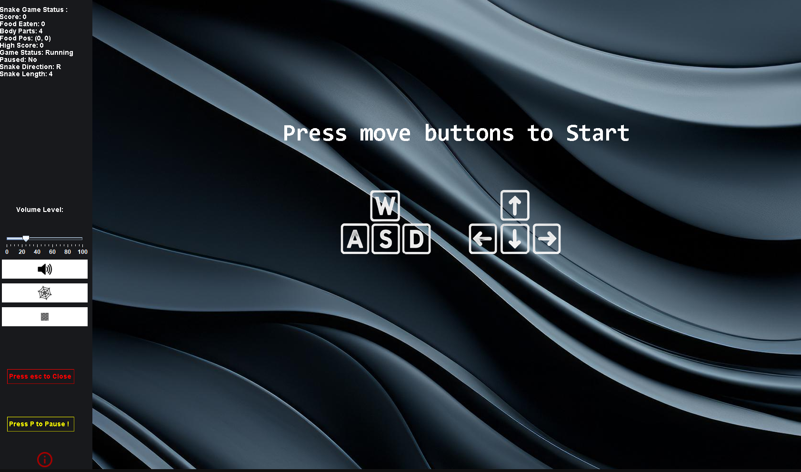
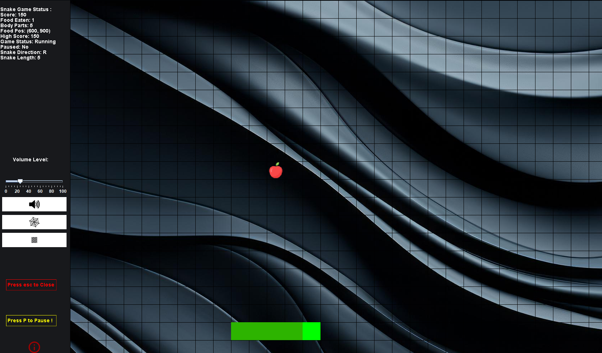
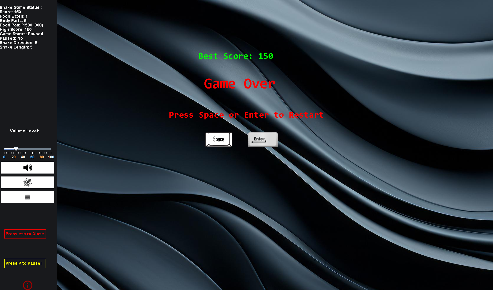

# 🐍 2D Classic Snake Game

A feature-packed, modern adaptation of the classic 2D Snake arcade game built from scratch in Java using Java Swing and AWT without external game engines.
This project emphasizes clean modular software architecture, event-driven programming, 2D graphics rendering, integrated audio management, and local game state persistence.

---

## 📸 Gameplay Preview

| Start Screen | In-Game Action | Game Over Screen |
| :---: | :---: | :---: |
|  |  |  |

---

## 🎮 Controls & Interface

### Game Controls
| Action | Key / Input |
| :--- | :--- |
| **Move Snake Up** | `W` or `↑` (Up Arrow) |
| **Move Snake Down** | `S` or `↓` (Down Arrow) |
| **Move Snake Left** | `A` or `←` (Left Arrow) |
| **Move Snake Right** | `D` or `→` (Right Arrow) |
| **Pause / Resume Game** | `P` |
| **Restart Game (After Game Over)** | `Space` or `Enter` |
| **Exit Application** | `Esc` |

### Interactive Sidebar HUD
* **Volume Slider:** Adjusts background music gain in real time.
* **Mute/Unmute Button:** Instantly toggles audio playback.
* **Grid Overlay Toggle:** Switches the playfield tile grid lines on and off.
* **Wall Collision Toggle:** Toggles pass-through wraparound mode versus lethal screen edges.
* **Info Button:** Displays game instructions and project credits.

---

## 🧠 Architecture & Key Concepts Implemented

### 1. Object-Oriented Programming & Modularity
* **Encapsulation & Inheritance:** `SnakeFrame` extends `JFrame`[cite: 2, 5], while `SnakePanel`[cite: 3, 6] and `SnakeStatus`[cite: 1, 7] extend `JPanel` to segregate presentation from canvas drawing.
* **Separation of Concerns:** Split into logical packages separating user interface views (`ui`) from game data/status representations (`model`).
* **Interface Implementation:** Utilizes `ActionListener` for clock-driven game ticks[cite: 3, 6] and reactive UI events[cite: 1, 7].

### 2. Game Loop & Real-Time State Updates
* **Timer-Driven Loop:** Managed via `javax.swing.Timer`[cite: 1, 3, 7] executing at defined millisecond intervals (`DELAY = 75ms`)[cite: 3, 6] to handle continuous coordinate recalculation, food consumption checks, and canvas repainting.
* **Focus & Event Decoupling:** Global input delegation ensures the main rendering canvas (`SnakePanel`) maintains active window focus even when adjusting interactive HUD components[cite: 1, 7].

### 3. Collision Detection & Mechanics
* **Grid Alignment:** Precise spatial partitioning using uniform cell sizes (`UNIT_SIZE = 50`)[cite: 3, 6] to keep food and snake parts perfectly locked into the grid.
* **Self-Collision (Head-to-Body):** Linear array traversal verifying coordinate parity between index `0` and body segment arrays `x[]` and `y[]`[cite: 3, 6].
* **Dynamic Boundary Modes:** Supports strict wall bounds (triggering game over on contact)[cite: 3, 6] as well as continuous wraparound geometry based on user configuration[cite: 3, 6].

### 4. Audio Processing & System Controls
* **Sampled Audio Playback:** Utilizes `javax.sound.sampled` (`Clip`, `AudioInputStream`)[cite: 1, 3, 6] for continuous looping background soundtracks[cite: 3, 6] and sound effect triggers[cite: 3, 6].
* **Real-Time Gain Modulation:** Applies linear-to-logarithmic decibel conversion via `FloatControl.Type.MASTER_GAIN`[cite: 1, 7] driven by slider changes[cite: 1, 7].

### 5. Data Persistence & File I/O
* **High Score Tracking:** File stream parsing and serialization through `Scanner` and `PrintWriter`[cite: 3, 6], persisting peak player performance to `saveFile.txt` across sessions[cite: 3, 6].

---

## 🛠️ Tech Stack & Standard Libraries

* **Language:** Java (JDK 17+)
* **GUI & Rendering:**
  * `javax.swing.*` (`JFrame`, `JPanel`, `JButton`, `JSlider`, `JOptionPane`, `Timer`)[cite: 1, 2, 7]
  * `java.awt.*` (`Graphics`, `Graphics2D`, `Color`, `Font`, `RenderingHints`, `Image`)[cite: 1, 3, 6]
* **Audio API:** `javax.sound.sampled.*` (`Clip`, `AudioSystem`, `AudioInputStream`, `FloatControl`)[cite: 1, 3, 6]
* **Event Handling:** `java.awt.event.*` (`KeyAdapter`, `KeyEvent`, `MouseAdapter`, `MouseMotionAdapter`, `ActionListener`)[cite: 1, 2, 3]
* **Packaging & Deployment:** `Launch4j` / `jpackage` bundled with custom embedded `JRE`

---

## 📂 Project Structure

```text
Snake-Game-demo/
│
├── src/
│   ├── snake/                     # Application launcher
│   │   └── SnakeGame.java         # Main entry point (SwingUtilities.invokeLater)
│   ├── ui/                        # Presentation & game canvas
│   │   ├── SnakeFrame.java        # Undecorated draggable window host
│   │   └── SnakePanel.java        # Main rendering canvas, game loop & controls
│   └── model/                     # HUD & configuration tracking
│       └── SnakeStatus.java       # Interactive side-panel controller & metrics
│
├── assets/                        # Standalone media & persistent storage
│   ├── audio/                     # Sound clips (.wav)
│   ├── data/                      # Local score saves (saveFile.txt)
│   └── icon/                      # Visual sprites, HUD buttons, and app icons (.png/.jpeg)
│
├── doc/                           # Project documentation
│   └── screenshots/               # Visual previews for documentation
│
├── JRE/                           # Embedded Java Runtime Environment for deployment
├── .gitignore
└── README.md